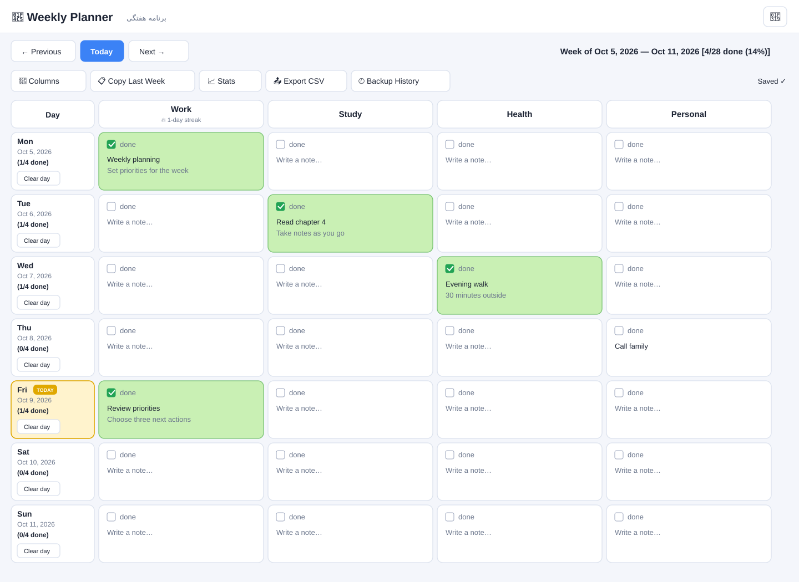

# Weekly Planner

[](https://github.com/itsopal/weekly-planner/actions/workflows/ci.yml)

A small, self-hosted weekly planner built with Flask and plain HTML, CSS, and JavaScript. Organize recurring areas of your life, track daily progress, and keep your notes in a local JSON file.

## Features

- Navigate calendar weeks and jump back to today.
- Track completion and add a note for each category on each day; changes save automatically.
- Add, rename, or remove categories.
- Copy notes from the previous week without copying completion status.
- Review progress, streaks, and export your planner as CSV.
- Switch between light and dark themes.
- Optional single-password login for a private, single-user deployment.
- Offline cell edits are kept in this browser and retried automatically with backoff when connectivity returns.
- Rotating history of the latest 10 data snapshots, with restore controls in the app.

## UI preview



This is an illustrative vector preview of the layout, not a browser screenshot; all shown notes are synthetic.

## Run locally

Requires Python 3.10 or newer.

```bash
git clone https://github.com/itsopal/weekly-planner.git
cd weekly-planner
python -m venv .venv
```

Activate the environment, then install the pinned runtime dependencies and start the app:

```bash
# macOS / Linux
source .venv/bin/activate
python -m pip install --require-hashes -r web_planner/requirements.lock
python web_planner/app.py
```

On Windows PowerShell, activate with `.venv\Scripts\Activate.ps1` instead. Open **http://127.0.0.1:5000** in your browser.

By default the site is open, which is convenient for local use. **Do not expose it to the internet without enabling a password and setting a strong secret key.** For a private deployment, configure both environment variables before starting the server:

```bash
export PLANNER_PASSWORD='choose-a-long-password'
export SECRET_KEY="$(python -c 'import secrets; print(secrets.token_hex(32))')"
python web_planner/app.py
```

PowerShell equivalents:

```powershell
$env:PLANNER_PASSWORD = 'choose-a-long-password'
$env:SECRET_KEY = python -c "import secrets; print(secrets.token_hex(32))"
python web_planner/app.py
```

See [DEPLOY.md](DEPLOY.md) for production and PythonAnywhere guidance, including persistent storage.

## Your data

Planner entries are stored in `planner_data.json` under `DATA_DIR` (defaults to `web_planner/`). The app keeps a legacy `.bak` file and up to 10 timestamped snapshots in `planner_backups/`; use **Backup History** in the app to restore a snapshot. Set `DATA_DIR` to a writable, persistent directory on hosts with ephemeral application storage, and back it up regularly.

For offline use, the app caches its shell and last loaded planner in this browser and persists unsynced cell edits in local storage. This requires an initial visit while online and a secure origin (HTTPS or localhost). Local browser storage is not encrypted; clear the site's browser data to remove the cached planner from that device. The JSON backend serializes threaded requests within one process; use a single WSGI worker process. Multiple worker processes need a shared database instead.

Planner JSON files, timestamped backup directories, temporary saves, local environment files, and Python caches are excluded by [`.gitignore`](.gitignore)—keep personal notes and secrets out of commits.

## Development

Install the pinned development/test tools and run the checks from the repository root:

```bash
python -m pip install --require-hashes -r web_planner/requirements-dev.lock
python -m ruff check web_planner tests
python -m ruff format --check web_planner tests
python -m pytest
# Also run these after changing frontend JavaScript:
node --check web_planner/static/app.js
node --check web_planner/static/service-worker.js
```

Install the optional pre-commit hooks with `pre-commit install`; they run the same lint/format checks plus basic file hygiene checks before each commit. GitHub Actions runs the test and quality checks on pushes and pull requests.

See [CONTRIBUTING.md](CONTRIBUTING.md) for the full contributor workflow. The Persian-language app guide is in [`web_planner/README.md`](web_planner/README.md).

## Project layout

```text
web_planner/
├── app.py                 # Flask app, API, and JSON persistence
├── requirements.txt       # pinned runtime dependency
├── requirements.lock      # resolved runtime dependency lock
├── requirements-dev.txt   # pinned developer/test tools
├── requirements-dev.lock  # resolved development dependency lock
├── templates/             # HTML pages
└── static/                # CSS and JavaScript

docs/                      # illustrative UI preview
tests/                     # Flask API and auth tests
```

## License

This project is licensed under the [MIT License](LICENSE).
